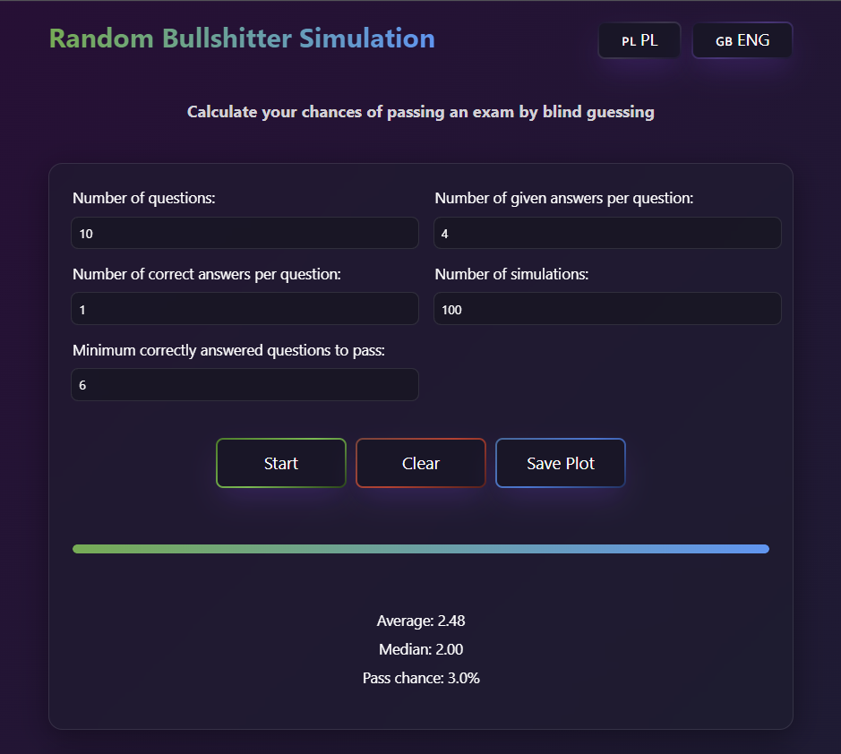
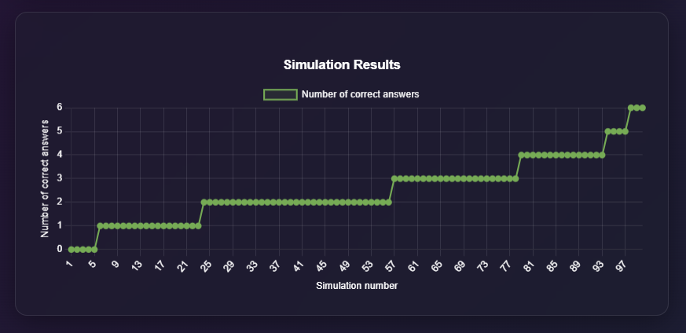

# Random Bullshitter Simulation

A web-based tool that simulates and calculates your chances of passing multiple-choice exams by random guessing. Perfect for students wondering if they can pass without studying or anyone curious about probability in testing scenarios.



## Description

Random Bullshitter Simulation is an interactive web application that helps you understand the probability of passing exams through blind guessing. By simulating thousands of tests with configurable parameters, it provides statistical insights into your chances of reaching passing thresholds without any knowledge of the subject matter.

### Features

* **Customizable Test Parameters**: Configure number of questions, answer options, correct answers per question
* **Multiple Simulations**: Run hundreds or thousands of test simulations instantly
* **Real-time Visualization**: See simulation results plotted on an interactive graph
* **Statistical Analysis**: Get average scores, median results, and pass rate percentages
* **Bilingual Support**: Switch between English and Polish interfaces
* **Export Capability**: Save simulation results as PNG images

### Built with

* HTML/CSS
* Vanilla JavaScript
* Chart.js for data visualization
* HTMX for enhanced interactivity

## Getting Started

### Prerequisites

This is a pure front-end application requiring only a modern web browser such as:

* Google Chrome (recommended)
* Mozilla Firefox
* Microsoft Edge
* Safari

### Installation

1. Clone the repository:
   
   ```
   git clone https://github.com/yourusername/random-bullshitter-simulation.git
   ```
   
   or just download the `index.html` file.

2. Launch the application by opening `index.html` in your browser
   or by running:
   
   ```
   open index.html  # on macOS
   ```
   
   or
   
   ```
   start index.html  # on Windows
   ```

## Usage

1. Set your test parameters:
   
   - Number of questions in the exam
   - Number of answer options per question
   - Number of correct answers per question
   - Minimum number of correct answers needed to pass
   - Number of simulations to run

2. Click the **Start** button to run the simulations.

3. View the results:
   
   - Statistical summary (average, median, pass chance)
   - Visual representation in the line chart
   - Pass threshold displayed as horizontal line

4. Save the visualization by clicking the **Save Plot** button.

5. Reset parameters with the **Clear** button.



## How It Works

The application uses probability theory to simulate multiple-choice testing scenarios:

1. For each question in a simulation, the probability of selecting a correct answer equals `(number of correct answers)/(total answer options)`.

2. The simulator runs through each question applying this probability, tracking correct answers.

3. After all questions are answered for all simulations, statistics are calculated:
   
   - **Average**: Mean number of correct answers across all simulations
   - **Median**: Middle value in the sorted results list
   - **Pass Chance**: Percentage of simulations that reached or exceeded the passing threshold

This approach accurately models the statistical behavior of random guessing on standardized tests.

## Technical Implementation

The core simulation function:

```javascript
function simulateTest(numQuestions, numAnswers, numCorrect) {
    let correct = 0;
    for (let i = 0; i < numQuestions; i++) {
        const p = numCorrect / numAnswers;
        if (Math.random() < p) {
            correct++;
        }
    }
    return correct;
}
```

## Contributing

Contributions are welcome! To contribute:

1. Fork the repository
2. Create a feature branch (`git checkout -b feature/amazing-feature`)
3. Commit your changes (`git commit -m 'Add some amazing feature'`)
4. Push to the branch (`git push origin feature/amazing-feature`)
5. Open a Pull Request

## License

This project is licensed under the MIT License - see the LICENSE file for details.

## Acknowledgements

* Chart.js for the visualization library
* HTMX for enhancing the UI interactivity
* All probability professors who made me realize I should have studied harder

---

**Note**: This simulation is for educational purposes and provides statistical probabilities. Actual test performance depends on many more factors than random chance! 